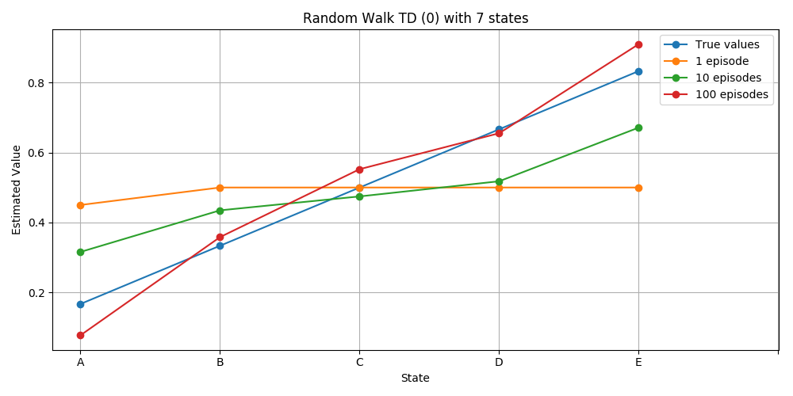
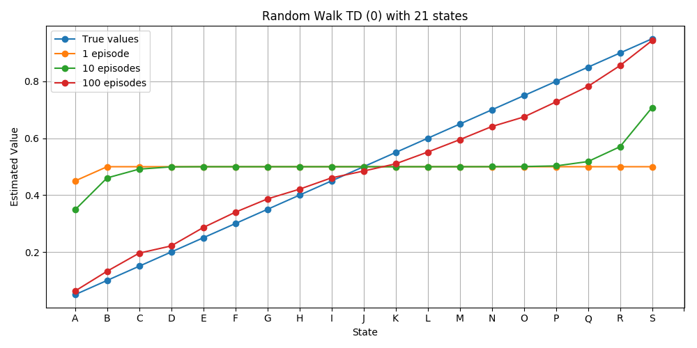

# TD(0) Implementation

## Package required
The script needs the [RandomWalk environment](../../environments/gym-random-walk).

## Plots

## References
- [Reinforcement Learning: An Introduction](http://incompleteideas.net/book/RLbook2018.pdf)
by Richard S. Sutton and Andrew G. Barto
  - **TD(0) Algorithm**: Chapter 6, equation 6.2.
  - **RandomWalk example**: Chapter 6, example 6.2.
