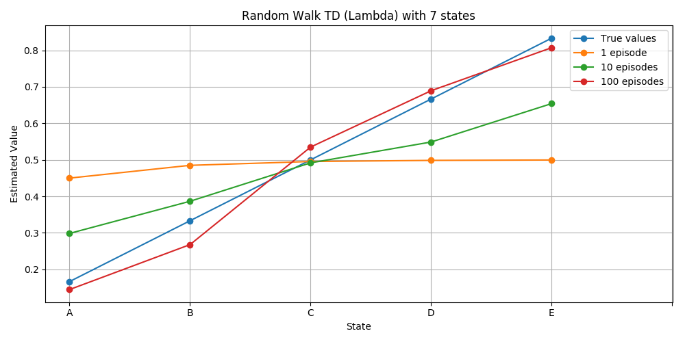
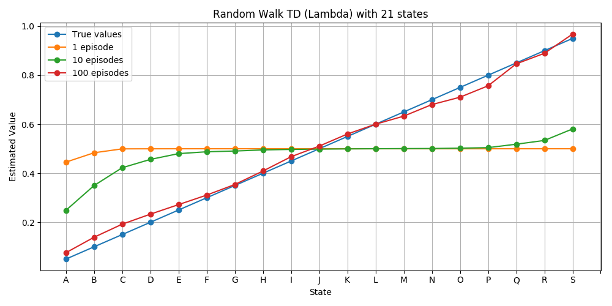

# TD(Lambda) Implementation

## Package required
The script needs the RandomWalk environment that can be found in this link
[https://github.com/mimoralea/random-walk](https://github.com/mimoralea/random-walk).

## Plots

## References
- [Reinforcement Learning: An Introduction](http://incompleteideas.net/book/RLbook2018.pdf)
by Richard S. Sutton and Andrew G. Barto
  - **TD(Lambda) Algorithm**: Chapter 6
  - **RandomWalk example**: Chapter 6, example 6.2.
